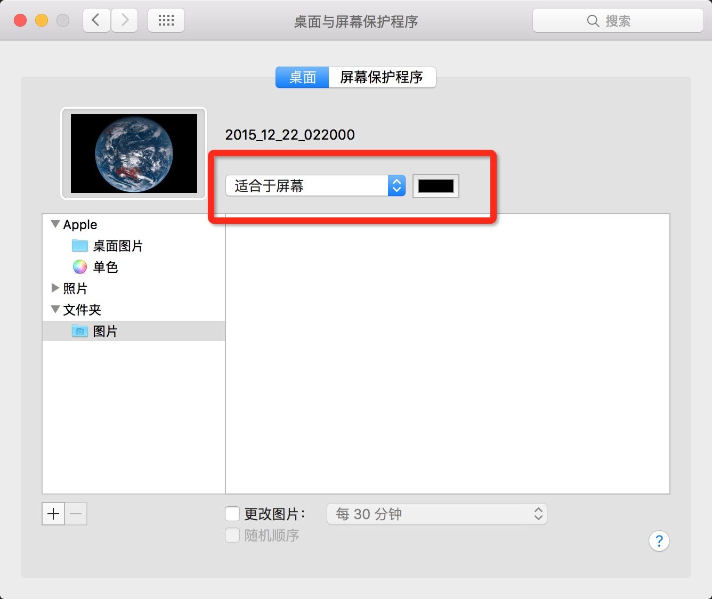

## MAC 馒头地球

## 下载地址

[http://7d9i8r.com1.z0.glb.clouddn.com/mac_mantou_earch.zip](http://7d9i8r.com1.z0.glb.clouddn.com/mac_mantou_earch.zip)

## 安装说明

1. 下载安装包
2. 解压并运行双击运行里面的 install
3. 查看桌面，壁纸跟换成功
4. 调整比例，打开 系统偏好设置 －》 桌面与屏幕保护程序 －》调整成类似下图



## 卸载说明

1. 打开终端
2. 运行下面的命令

```
launchctl unload ~/Library/LaunchAgentsooo.oxo.apps.earth.launchctl.plist
rm ~/Library/LaunchAgentsooo.oxo.apps.earth.launchctl.plist
rm -rf ~/.mantou_earth
```